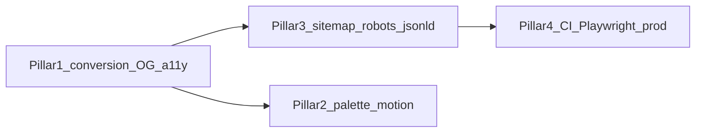

# Portfolio site roadmap (fresh)

## Snapshot of today

Stack and scripts live in [`package.json`](c:/Users/jneig/Portfolio/portfolio-website/package.json): Next **15**, React **19**, Tailwind **4**, Vitest, Playwright, ESLint/Prettier, Husky/lint-staged. CI in [`.github/workflows/ci.yml`](c:/Users/jneig/Portfolio/portfolio-website/.github/workflows/ci.yml) runs format, lint, typecheck, unit tests, and **`next build`** - **Playwright is not in CI** even though [`playwright.config.ts`](c:/Users/jneig/Portfolio/portfolio-website/playwright.config.ts) and [`tests/e2e/smoke.spec.ts`](c:/Users/jneig/Portfolio/portfolio-website/tests/e2e/smoke.spec.ts) exist.

UX is a **single scroll + sidebar** composed in [`src/app/[[...slug]]/HomeClient.tsx`](c:/Users/jneig/Portfolio/portfolio-website/src/app/[[...slug]]/HomeClient.tsx) (Hero, About, Skills, Experience, Projects, Certifications - **no Contact section yet**). Global SEO-ish metadata is in [`src/app/layout.tsx`](c:/Users/jneig/Portfolio/portfolio-website/src/app/layout.tsx). There is **no** App Router **`sitemap.ts` / `robots.ts`**, **no** `opengraph-image` asset, **no** `middleware.ts`.

Brand constraints are authoritative in [`docs/design-system.md`](c:/Users/jneig/Portfolio/portfolio-website/docs/design-system.md): editorial brutalism, tokens, **`bru-*`** patterns, **`prefers-reduced-motion`** - flare must stay honest and readable, not generic SaaS gloss.

### Audience and positioning (you)

Primary buyers are **consulting clients and partners** (plus recruiters who hire consultants into staff aug). Tone stays expert and calm; personality lives in **one or two deliberate touches** (see skiing below), not novelty overload.

---

## Pillar 1 - Professional polish (what clients and hiring managers notice first)

1. **Clear conversion path (consultant-shaped)** - Dedicated **Work with me / Contact** strip: email, calendar booking link (Cal.com etc.), LinkedIn/GitHub, optional **short PDF capability sheet** or rate band (“From…” / “Typical engagements”). Repeat a compact CTA after Projects. Clarify **modes**: advisory, delivery, fractional, workshop - even as a single-line “I take on X, Y, Z” to filter bad leads.

2. **Share cards** - Add **`opengraph-image`** (and optionally Twitter image); switch Twitter metadata from **`summary`** to **`summary_large_image`** once artwork exists [`layout.tsx`](c:/Users/jneig/Portfolio/portfolio-website/src/app/layout.tsx).

3. **Story depth (consultant case studies)** - Same narrative spine (problem → constraints → **your role** → what shipped → outcome/metrics). Add **client context** without breaking NDAs: industry, team size, stack, duration, “embedded vs lead” - anonymize as needed. Optionally a **“Selected outcomes”** strip: 3 bullets of business/tech impact across clients.

4. **Trust signals** - Footer: location/availability, **response time or next window** for new work, “last updated”. Optional **logo row** only where contracts allow; otherwise neutral labels (“Fortune 500 SaaS”, “UK scale-up”). Privacy note if analytics/forms land later.

5. **Accessibility** - Skip link to `#main`, sensible heading order per section, focus trap + ESC for any overlay/modals (future ⌘K palette), audit sidebar landmarks vs [`Sidebar.tsx`](c:/Users/jneig/Portfolio/portfolio-website/src/app/components/nav/Sidebar.tsx).

6. **Performance story** - Continue `next/font`; when adding photos/screenshots, explicit **`sizes`** and lazy vs priority on hero assets; optional **`next bundle analyzer`** when dependency surface grows.

---

## Pillar 2 - Flare and gimmicks (on-brand only)

Ideas that reinforce **publication / print shop** energy rather than neon gamer UI:

- **Command palette** - ⌘/Ctrl+K for sections, projects, “copy email”, theme toggle; reserve hidden commands for personality (still documented in Styleguide).

- **Micro-interactions** - Reuse existing enter animations (`animate-enter`, patterns in [`Reveal.tsx`](c:/Users/jneig/Portfolio/portfolio-website/src/app/components/Reveal.tsx)); optional section-index ticks or halftone pulse tied to scroll - subtle.

- **Styleguide as playground** - Extend [`StyleguideOverlay.tsx`](c:/Users/jneig/Portfolio/portfolio-website/src/app/components/StyleguideOverlay.tsx) with recipes before shipping new chrome so gimmicks stay consistent.

- **Optional Easter eggs** - e.g. chord shortcut toggling grid overlay intensity or a dev-only build stamp - **must respect reduced motion** and ship behind harmless defaults.

### Additional gimmick ideas (still on-brand)

- **“Print proof” mode** - Toggle that adds crop / registration marks or a faint folio margin (you already flirt with this in Hero); palette action: “Proof: on/off”.
- **Live clock or timezone strip** - Small label “local / UK” updating once per minute - signals remote collaboration without clutter.
- **Konami-adjacent shortcut** - Unlocks a **one-session** denser grid overlay or monochrome high-contrast variant; resets on reload; no persistence required.
- **One-shot typewriter or line-reveal** - Single hero line or subtitle animates once on first visit (`sessionStorage`), never on repeat - avoids annoyance.
- **Copy-as-Markdown** - Palette: “Copy About as .md” or “Copy project summary” for recruiters who paste into ATS - surprisingly practical, still a “gimmick” in a good way.
- **ASCII / DEC-style status line** - Footer or Styleguide shows git SHA, build time, Node major - ties into CI truthfulness if you expose env safely at build time.
- **Fake “ruler drag”** - Cursor near viewport edge briefly shows a measuring tick (pure CSS); disable entirely under reduced motion.
- **Sound** - Only if opt-in via palette (“Audio: off default”); tiny UI tick on toggle - skip entirely if it clashes with your taste.

### Skiing - personality without kitsch

Use skiing as **human proof**, not as a second brand.

- **About / Hero one-liner** - Single factual line (“Based in … · skis when the lifts cooperate”) or a spare footer aside - avoids mascot energy.
- **Palette or footer aside** - Optional tongue-in-cheek label only if it stays subtle (e.g. season-aware copy driven by date - **optional**, easy to remove).
- **Data-forward hook** - If you track **ski days vs billable weeks** (or elevation vs commits - only if honest), one small **bru-panel figure** reads memorable for visitors who like graphs; skip fake charts.
- **Visual restraint** - No avalanche of emoji/snowflakes; no hero takeover - aligns with [`docs/design-system.md`](c:/Users/jneig/Portfolio/portfolio-website/docs/design-system.md).

---

## Storytelling and data-forward enhancements

Lean into **editorial figures**: captions, axes-as-rules, and tables styled like specimen sheets - not glossy dashboards.

- **Impact metrics inline** - Per project: 2–4 numbers with labels (“latency −40%”, “MAU”, “incidents/week”) as a **bru-panel figure row**; pairs with narrative in case studies (Pillar 1).
- **Before → after snapshot** - Side-by-side or stacked bars for “baseline vs shipped” (same metric); keeps proof scannable.
- **Timeline / tenure strip** - Horizontal axis with roles as labeled intervals (pure CSS grid + borders); optional tiny dots for milestones - no animation required.
- **Skill “confidence” or usage bars** - Honest stacked or horizontal bars (years or relative weight); avoid spider charts unless simplified - readability first.
- **Sparklines** - Inline SVG trends for “traffic”, “error rate”, “cost” where you have real series; caption source + window (“last 90d”).
- **Heatmap-style grid** - E.g. contribution-style calendar **only if** you have defensible data (GitHub API, manual CSV, or aggregated logs); otherwise skip - fabricated grids hurt trust.
- **Simple charts without heavy libs** - Prefer CSS + SVG + typed content props first; add **Recharts** or **Visx** only if interactions (tooltip, brush) justify bundle cost - wrap in dynamic import if used.
- **“Methods” appendix** - One collapsible panel per case study: stack, constraints, links - satisfies engineers who skim for rigor.
- **Consultant funnel metrics** (optional, real data only) - Sparkline or counter strip: inbound leads/month, proposal→win rate, engagement length distribution - powerful if you actually track it; omit otherwise.

Pair all figures with **`prefers-reduced-motion`**: static SVGs by default; animate stroke-dashoffset or counts only when motion is allowed.

---

## Pillar 3 - Industry-standard additions (mostly missing today)

| Item                                                                                                | Why                                                                            |
| --------------------------------------------------------------------------------------------------- | ------------------------------------------------------------------------------ |
| [`src/app/sitemap.ts`](https://nextjs.org/docs/app/api-reference/file-conventions/metadata/sitemap) | Crawlers + canonical discovery                                                 |
| [`src/app/robots.ts`](https://nextjs.org/docs/app/api-reference/file-conventions/metadata/robots)   | Control indexing; point to sitemap                                             |
| JSON-LD **`Person`** / **`WebSite`**                                                                | Structured identity for search; keep factual                                   |
| **`manifest.ts`** or static web manifest                                                            | Icons + name when saved to home screen                                         |
| **`public/humans.txt`**, optional **`/.well-known/security.txt`**                                   | Engineer-culture optional niceties                                             |
| Privacy-first analytics (Plausible, Vercel Analytics, or none)                                      | Only with a one-line policy if needed                                          |
| Security headers via [`next.config.ts`](c:/Users/jneig/Portfolio/portfolio-website/next.config.ts)  | Start conservative; CSP often report-only first - **no `middleware.ts` today** |

---

## Pillar 4 - CI and tooling

| Change                       | Detail                                                                                                                                                                                                                                                                 |
| ---------------------------- | ---------------------------------------------------------------------------------------------------------------------------------------------------------------------------------------------------------------------------------------------------------------------- |
| **E2E in CI**                | New job: `npm run build` then `next start` (or `start` from standalone) and **`playwright test`** - more stable than long-running `next dev` in CI [`playwright.config.ts`](c:/Users/jneig/Portfolio/portfolio-website/playwright.config.ts) currently uses dev server |
| **Failure artifacts**        | Upload Playwright HTML report (and traces) on failure                                                                                                                                                                                                                  |
| **Browser cache**            | Cache Playwright browser install between runs                                                                                                                                                                                                                          |
| **Coverage (optional)**      | `test:coverage` with a low bar on critical utils/components - avoid gaming numbers                                                                                                                                                                                     |
| **Lighthouse CI (optional)** | Budgets for LCP/CLS on `/` and a deep route after heavy media                                                                                                                                                                                                          |
| **Dependabot**               | Already in [`.github/dependabot.yml`](c:/Users/jneig/Portfolio/portfolio-website/.github/dependabot.yml); optional grouping tweaks only if noise hurts                                                                                                                 |

---

## Suggested rollout order

1. **Pillar 1** - Contact/CTA + OG images + footer trust line + skip link / quick a11y fixes.
2. **Pillar 3** - sitemap, robots, JSON-LD, manifest.
3. **Pillar 4** - Playwright against production server + artifacts.
4. **Pillar 2** - Palette + layered motion/easter eggs last so tests and SEO baseline exist first.

---

## Turning this roadmap into tickets

Use **one epic per pillar** (or per rollout slice); keep tickets **vertical slices** shippable in a PR.

**Suggested hierarchy**

- **Epic** - Matches a pillar or milestone (e.g. “Pillar 3 - Discovery & metadata”).
- **Story** - User-visible outcome (“Visitors see accurate link previews when sharing `/projects`”).
- **Task** - Implementation step (“Add `opengraph-image.tsx` using design tokens”, “Extend smoke E2E for sitemap 200”).

**Label / tag scheme (examples)**

- `area:seo`, `area:a11y`, `area:ci`, `area:content`, `area:design-system`, `area:consulting-cta`
- `size:XS|S|M|L` or story points - your tool’s convention
- `blocks-release` only for true ordering deps (e.g. OG image before Twitter `summary_large_image` flip)

**Acceptance criteria template** (paste into each story)

1. **Given** [context - e.g. production build] **when** [action] **then** [observable result].
2. **Docs**: design-system / Styleguide updated if new pattern.
3. **Motion**: behaves under `prefers-reduced-motion: reduce`.
4. **Tests**: unit and/or Playwright updated where behavior is user-critical.

**Candidate ticket dump** (split/merge as you like)

- Contact / **Work with me** section + engagement modes line + sidebar anchor + secondary CTA after Projects + booking link.
- Copy pass: positioning as **software consultant** (metadata, Hero subtitle, JSON-LD `jobTitle`/description).
- Consultant case study template + 1 anonymized pilot + outcomes strip.
- Optional: skiing one-liner + optional honest leisure/lifestyle chart (only with real inputs).
- `opengraph-image` + Twitter card type + preview check (Slack/iMessage).
- Skip link + landmark / heading audit + palette focus trap (when palette exists).
- `sitemap.ts` + `robots.ts` + manual verify in Search Console later.
- JSON-LD `Person` / `WebSite` + validate in Rich Results tester.
- Web manifest + icons.
- Playwright CI job: `build` → `start` → e2e; upload HTML report on failure; cache browsers.
- ⌘K palette v1 + Styleguide recipes + reduced-motion tests.
- Case study layout + figure row component + 1–2 pilot projects with real metrics.
- Optional: sparkline or bar “figure” component + content schema fields (`metric`, `unit`, `series?`).

**Workflow tip** - Order tickets to match the **rollout diagram** above; don’t open every gimmick ticket at once - batch Pillar 2 after SEO/CI stabilize so you’re not chasing flakes and delight at the same time.

---

## Out of scope unless you explicitly want them

Blog/RSS (unless you commit to writing), comment systems, heavy 3D/WebGL, cookie banners without analytics, full offline PWA - each is a product decision larger than polish.
